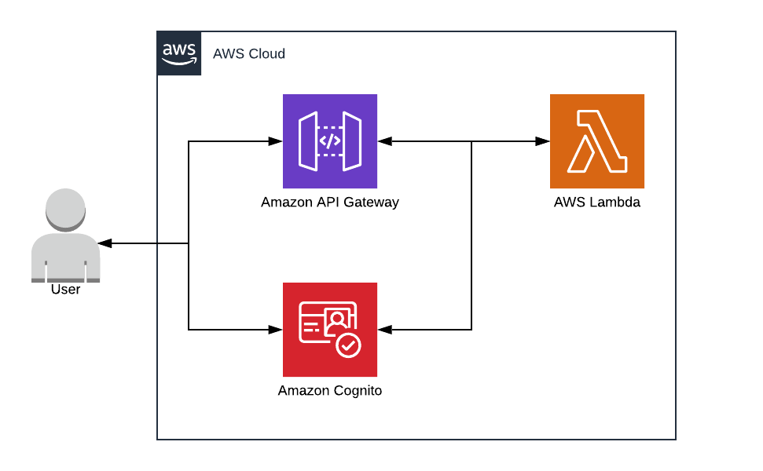

# aws-api-gateway-cognito

AWS API Gateway with lambdas functions and AWS Cognito

## Infrastructure



## Requirements

- [NodeJS](https://nodejs.org/en/)
  - [Serverless](https://www.serverless.com/) `$ npm install serverless -g`
- [Python3](https://www.python.org/downloads/) with pip (optional: see `Create and authenticate a user using our python script (new)` part)
  - [Boto3](https://aws.amazon.com/sdk-for-python/) `$ python -m pip install boto3`

## Configuration

At first, you need to have the credetials for your AWS account in `~/.aws/credentials`.


Before you deploy the resources, you can modify the `config.json` file.

In this file you'll find some particular information about the deployment like the name of the service, the name of the Cognito User Pool, the region where you want to deploy it...

You should modify with your proper information.

## Deployment

You can now start the deployment into using the serverless command: `$> serverless deploy`.

## Test your API Gateway with Cognito

When the deployment is done, you can find in the AWS Console the different resources deployed such as API Gateway, Lambdas and Cognito.

If you want to test the authentication, you need to create a user into your Cognito User Pool and get a token for your user, that's why you have the `example-auth.json` file.

First, you have to connect to the AWS Console and go on Cognito -> User Pool -> Your User Pool (get and save your Pool Id) --> App Clients and click on `Show details` and click on `Enable username password auth for admin APIs for authentication (ALLOW_ADMIN_USER_PASSWORD_AUTH)` and Save app client changes. (get and save your App client Id too).

### Create and authenticate a user using our python script (new)

We've created a new [script](cognito_user.py) that you can use to create and/or authenticate a user.
You can take a look at the different possibility using this script by running the following command:
`$ ./cognito_user.py --help`

#### Create a user

Once it's done you can simply run the following command:

```shell
$ ./cognito_user.py mail@example.com $userPoolId $clientId --region $region --profile $profile --create
User password:
Token: eyJraWQiOiJuOXJFTE1qZlwvZ0hCakEwRDFOVzZGYk...
```

> Note that the given password (`User password`) will be your final password. We'll first generate a random temporary password to validate the NEW_PASSWORD_REQUIRED change.
>
> The `--profile` is your profile already configured through AWS CLI (see `$ aws configure help`)
>
> The above command will return you a token that you can use to make authenticated requests.

#### Authenticate a user

If you've already created a user you can avoid the `--create` to only authenticate your user. It will also return you a token that you can use to make authenticated requests:

```shell
$ ./cognito_user.py mail@example.com $userPoolId $clientId --region $region --profile $profile
User password:
Token: eyJraWQiOiJuOXJFTE1qZlwvZ0hCakEwRDFOVzZGYk...
```

### Create and authenticate a user step by step with AWS CLI

#### Create a user

To create a user you have to launch the following command (replace the $ variables, and note that you will need to change the password):

`$> aws cognito-idp admin-create-user --user-pool-id $userPoolId --username $userName --temporary-password $userPassword`


You now have to modify the `example-auth.json` into replacing the different variables and do the following command to initiate your user:

`$> aws cognito-idp admin-initiate-auth --cli-input-json file://example-auth.json`

copy the value of `Session` in the output and do the following command to change the password (replace the $ variables):

`$> aws cognito-idp admin-respond-to-auth-challenge --user-pool-id $userPoolId --client-id $clientId --challenge-name NEW_PASSWORD_REQUIRED --challenge-responses NEW_PASSWORD=$newPassword,USERNAME=$userName --session $session`


#### Use your user to test endpoints which required authentication

Once you have your user created, initiated and with a new password (don't forget to change the password by the new password in the `example-auth.json` file) you can do the following command and get your token:

`$> aws cognito-idp admin-initiate-auth --cli-input-json file://example-auth.json`

In the output, the value of `tokenId` is your token, you can use it to make some requests to your endpoints (with Postman for example).
